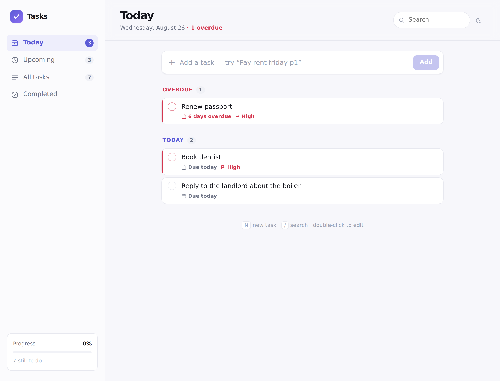

# ToDo_App

A ToDo list application with a React frontend, an Express REST API, and file-backed
storage. Add, edit, delete, complete, filter, search and sort your tasks.



## Features

- **Full task CRUD** — create, read, update and delete tasks through a REST API.
- **Mark complete** — one click to complete or reopen, plus bulk *Complete all* and
  *Clear completed*.
- **Task details** — title, priority (low / normal / high) and an optional due date,
  all editable in place.
- **Filter, search and sort** — filter by all / active / completed, search titles and
  notes, and sort by date added, due date, priority or A–Z.
- **At-a-glance progress** — remaining count, completion bar, and overdue / due-today
  flags.
- **Modern, clean design** — responsive card layout, light and dark themes, keyboard
  accessible, with loading and empty states.
- **Durable storage** — tasks persist to a JSON file via atomic writes.

## Getting started

Requires Node.js 20 or newer.

```bash
npm install          # installs both workspaces
npm run dev          # starts the API on :4000 and the app on :5173
```

Open <http://localhost:5173>. The Vite dev server proxies `/api` to the backend, so
the browser only ever talks to one origin.

### Other commands

| Command | What it does |
| --- | --- |
| `npm test` | Runs the server test suite (model + API). |
| `npm run build` | Builds the production frontend into `client/dist`. |
| `npm start` | Runs the API alone (serve `client/dist` with any static host). |

## Project layout

```
client/                 React frontend (Vite)
  src/App.jsx           Screen composition and app-level state
  src/api.js            Typed wrapper around the REST API
  src/hooks/useTasks.js All task state and server calls
  src/components/       Composer, toolbar, list, item, stats
  src/lib/dates.js      Due-date formatting
  src/styles.css        Design tokens and component styles
server/                 Express REST API
  src/app.js            Routes and error handling
  src/model.js          Validation and task logic (pure, unit tested)
  src/store.js          JSON-file repository (atomic writes) + in-memory store
  test/                 Model and HTTP tests
scripts/dev.js          Runs both services with one command
```

The API layer stays thin: every rule about what a valid task is lives in
`server/src/model.js` as pure functions, which is what makes the test suite fast and
the route handlers short.

## API

Base URL `http://localhost:4000/api`. All responses are JSON; errors take the shape
`{ "error": { "message": "…", "details": { "field": "…" } } }`.

| Method | Path | Description |
| --- | --- | --- |
| `GET` | `/health` | Liveness check. |
| `GET` | `/tasks` | List tasks. Query: `filter=all\|active\|completed`, `q=text`, `sort=created\|due\|priority\|alpha`. Returns `{ tasks, stats }`. |
| `POST` | `/tasks` | Create a task. Body: `{ title, priority?, dueDate?, notes? }`. → `201 { task }`. |
| `GET` | `/tasks/:id` | Fetch one task. |
| `PATCH` | `/tasks/:id` | Update any subset of `title`, `notes`, `priority`, `dueDate`, `completed`. |
| `DELETE` | `/tasks/:id` | Delete a task. → `204`. |
| `POST` | `/tasks/complete-all` | Body: `{ completed: boolean }`. Completes or reopens everything. |
| `POST` | `/tasks/clear-completed` | Removes every completed task. |

`stats` accompanies list responses and always describes the whole list, not the
filtered view: `{ total, completed, active, overdue, dueToday }`.

### Task shape

```json
{
  "id": "0f0c2b1e-…",
  "title": "Renew passport",
  "notes": "",
  "completed": false,
  "priority": "high",
  "dueDate": "2026-08-20",
  "createdAt": "2026-08-24T18:30:37.772Z",
  "updatedAt": "2026-08-24T18:30:37.772Z",
  "completedAt": null
}
```

Due dates are plain `YYYY-MM-DD` calendar dates so they never shift across time
zones. Send `"dueDate": null` to clear one.

### Example

```bash
curl -X POST localhost:4000/api/tasks \
  -H 'content-type: application/json' \
  -d '{"title":"Renew passport","priority":"high","dueDate":"2026-08-20"}'
```

## Deploying (getting a public URL)

In production the Express server serves the built React app as well as the API,
so the whole thing is **one service on one URL** — no separate frontend host, no
CORS setup.

Test that locally before deploying:

```bash
npm run build     # builds the frontend into client/dist
npm start         # serves app + API together on http://localhost:4000
```

### Render (free)

`render.yaml` in this repo is a Render Blueprint, so Render configures itself:

1. Sign up at [render.com](https://render.com) with your GitHub account.
2. **New → Blueprint**, pick this repository, click **Apply**.
3. Wait for the first build (2–5 minutes). Render gives you a public address like
   `https://todo-app-xxxx.onrender.com` — that is the link to share.

Deploying by hand instead of via the blueprint? Use these settings:

| Setting | Value |
| --- | --- |
| Build command | `npm install --include=dev && npm run build` |
| Start command | `npm start` |
| Environment | Node |

**Storage on free hosting:** tasks live in a JSON file, and free plans wipe the
disk on restart and on every deploy, so tasks reset from time to time. Free
services also sleep after ~15 minutes idle, making the next visit slow to load.
For tasks that persist, attach a persistent disk (paid) or move storage to a
database — `server/src/store.js` is the only file that touches storage, and it
already defines the interface a database version would implement.

## Configuration

| Variable | Default | Used by |
| --- | --- | --- |
| `PORT` | `4000` | API listen port. |
| `TASKS_FILE` | `server/data/tasks.json` | Where tasks are stored. |
| `CLIENT_DIR` | `client/dist` | Built frontend served in production. |
| `API_URL` | `http://localhost:4000` | Backend the Vite dev server proxies to. |

## Tests

```bash
npm test
```

46 tests cover the model (validation, filtering, sorting, stats, stored-data repair)
and the HTTP layer end to end (status codes, validation errors, 404s, bulk routes),
running the real Express app against an in-memory store.
